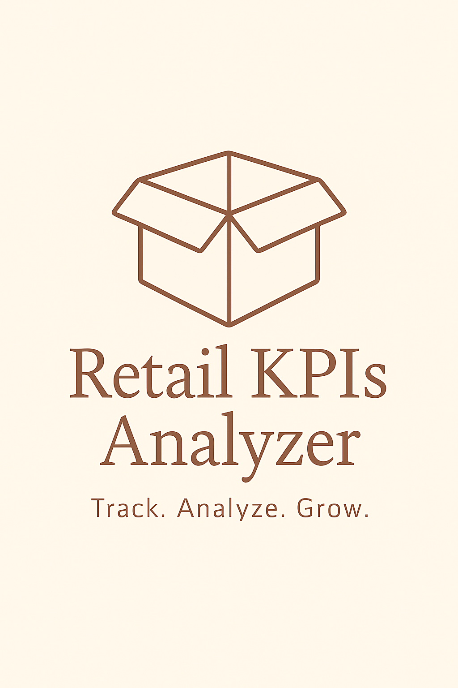
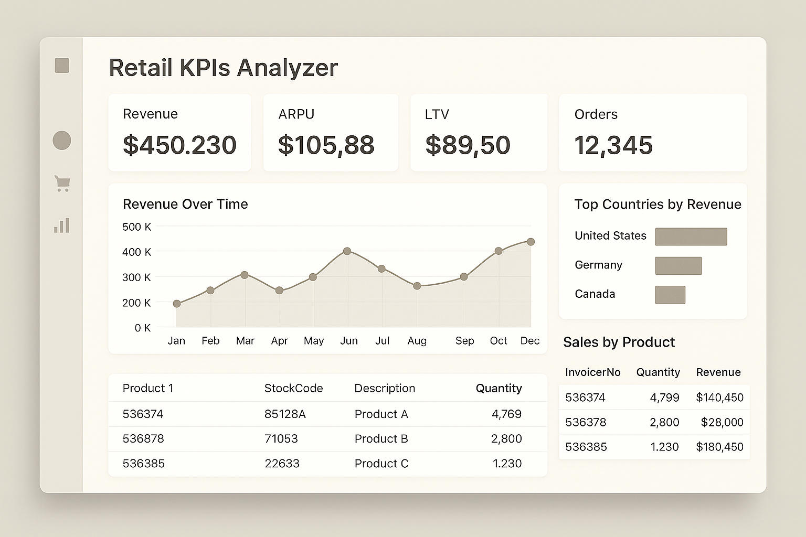
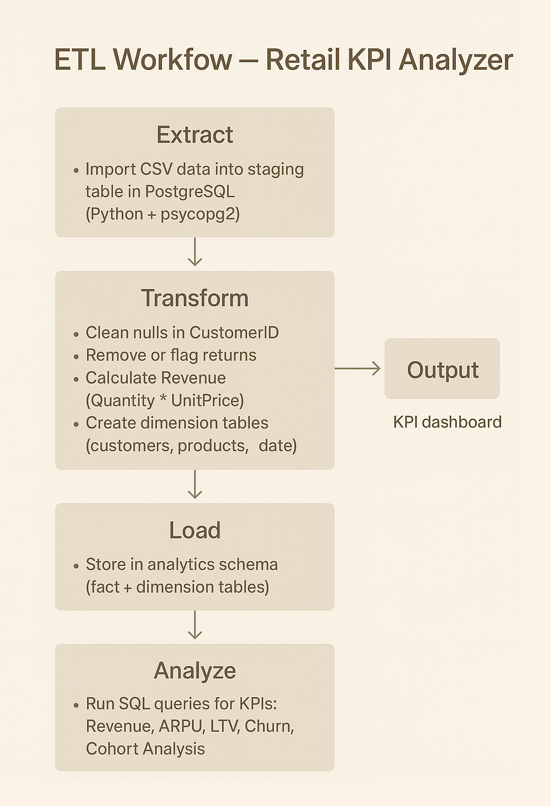

# 📦 Retail KPI Analyzer

A complete ETL and analytics solution for extracting, transforming, and loading retail sales data into a PostgreSQL database, enabling calculation of key business metrics (KPI) such as revenue, ARPU, LTV, churn, retention, and cohort analysis. Built with Python, SQL, and PostgreSQL, the project demonstrates the full pipeline from raw CSV to actionable business insights.

---

📷 **Logo**

  

---

## 💡 Purpose of this project

The **Retail KPI Analyzer** project was created to help businesses transform raw transaction data into valuable insights for decision-making.  
By automating the process of cleaning, structuring, and loading sales data into a database, and then calculating a set of well-known business KPIs, the project helps to:

- monitor revenue trends and identify growth opportunities,  
- measure customer value (LTV) and acquisition efficiency (CAC),  
- analyze customer retention and churn rates over time,  
- track the performance of sales cohorts to detect behavioral shifts,  
- support management in making data-driven strategic decisions instead of relying solely on intuition.

As a result, **Retail KPI Analyzer** enables companies to understand their sales performance, optimize marketing spend, and improve customer loyalty, ultimately leading to higher profitability and sustainable growth.

### Example mockup:

  

---

## 📊 About the Data

The dataset comes from the **Online Retail** dataset (UCI Machine Learning Repository) — a real-world transactional dataset from a UK-based e-commerce retailer.  

Each row represents a single invoice line: a product purchase made by a specific customer at a given date, including product details, quantity, and price.  

**Dataset info:**
- **Period covered**: December 2010 – December 2011  
- **Transactions**: ~540,000  
- **Customers**: ~4,300 unique IDs  
- **Products**: ~4,000 stock codes  

---

### Columns

- **InvoiceNo** – Transaction invoice number  
- **StockCode** – Unique product code  
- **Description** – Product name  
- **Quantity** – Units purchased (negative for returns)  
- **InvoiceDate** – Date and time of transaction  
- **UnitPrice** – Price per unit (£)  
- **CustomerID** – Unique customer identifier  
- **Country** – Customer’s country  

---

The dataset is ideal for calculating business KPIs such as:
- **Revenue** = Quantity × UnitPrice  
- **ARPU** (Average Revenue per User)  
- **LTV** (Lifetime Value)  
- **Churn Rate** and **Retention Rate**  
- **Cohort-based retention analysis**  
- **Profit Margin** (if COGS is added or simulated)  
- **Conversion rates** (with marketing data integration)  

---

## 🛠 Technologies and tools

- **Python 🐍** — data processing and transformation  
- **PostgreSQL** — database storage and analytics  
- **psycopg2** — database connection  
- **Pandas** — data manipulation  
- **Matplotlib / Seaborn** — visualizations  
- **dotenv** — secure credentials management  
- **Jupyter Notebook** — exploratory data analysis (EDA) and presentation  

---

## 🚀 Skills demonstrated in this project

- building a **full ETL pipeline** (Extract → Transform → Load) from CSV to PostgreSQL  
- designing a relational schema for analytics (fact and dimension tables)  
- writing advanced SQL queries to calculate KPIs  
- performing **cohort analysis** and churn/retention metrics in SQL  
- integrating Python with SQL for combined analysis & visualization  
- cleaning and preprocessing transactional datasets  
- creating **reproducible analytical workflows** for business intelligence  

---

## 📋 Features and Flow

1. **Extract** — Import raw CSV data (Online Retail dataset) into a staging table in PostgreSQL.  
2. **Transform** —  
   - Remove invalid rows (null customer IDs, negative quantities for returns analysis)  
   - Calculate revenue per transaction line  
   - Create dimensional tables: customers, products, date  
   - Create a fact table with transactional data  
3. **Load** — Store transformed data in PostgreSQL analytics schema.  
4. **Analyze** — Execute SQL queries to calculate:  
   - Monthly revenue trends  
   - ARPU and LTV per customer  
   - Monthly churn and retention rates  
   - Cohort retention curves  
5. **Visualize** — Create Python-based charts showing KPIs over time.  
6. **Publish** — Push all code, SQL scripts, and documentation to GitHub with clear instructions for replication.

  

---

