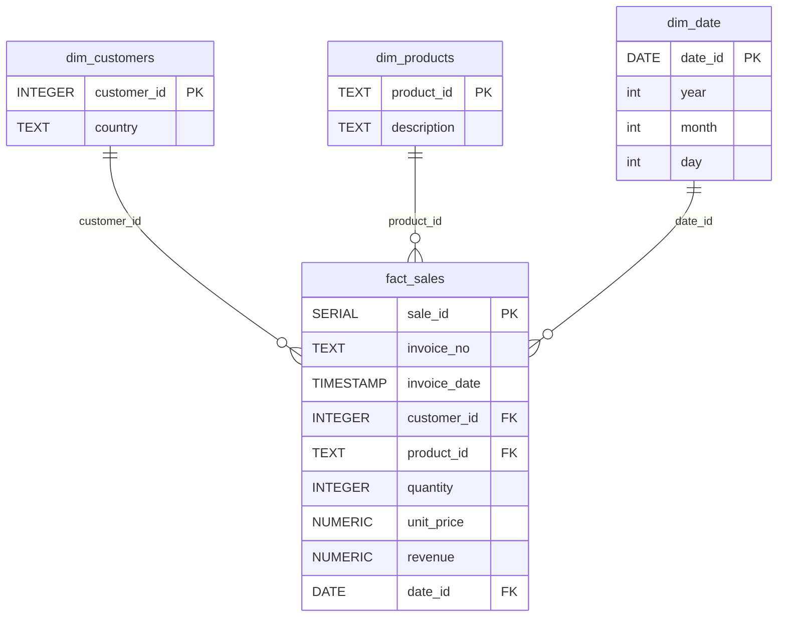

```mermaid
erDiagram
    dim_customers {
        INTEGER customer_id PK
        TEXT country
    }
    
    dim_products {
        TEXT product_id PK
        TEXT description
    }
    
    dim_date {
        DATE date_id PK
        int year
        int month
        int day
    }
    
    fact_sales {
        SERIAL sale_id PK
        TEXT invoice_no
        TIMESTAMP invoice_date
        INTEGER customer_id FK
        TEXT product_id FK
        INTEGER quantity
        NUMERIC unit_price
        NUMERIC revenue
        DATE date_id FK
    }
    
    dim_customers ||--o{ fact_sales : "customer_id"
    dim_products ||--o{ fact_sales : "product_id"
    dim_date ||--o{ fact_sales : "date_id"
```
